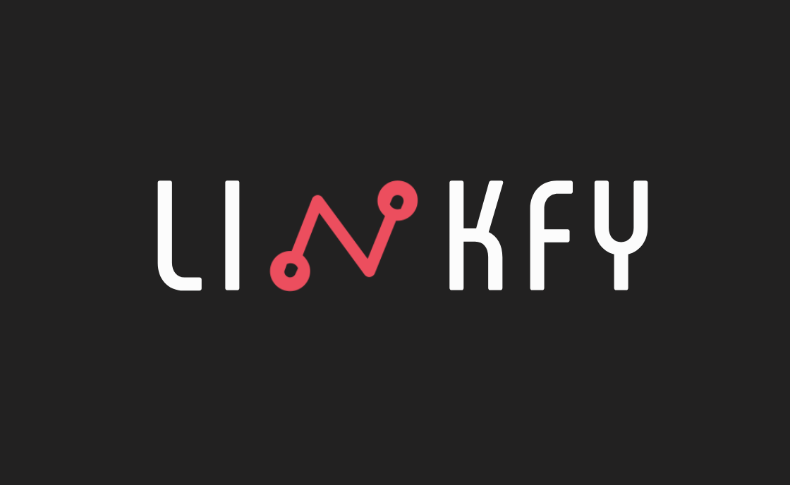

# Introduction

Linkfy is an API that forms part of a broader platform, which includes both the API and an Admin Client for management. Designed as a dynamic link service with deep linking capabilities, Linkfy offers a robust alternative to Firebase Dynamic Link—while being entirely self-hosted.

With Linkfy, you gain full control over your dynamic linking infrastructure, enabling you to create, manage, and track links seamlessly. The platform is tailored for those who prefer hosting their own services and desire an integrated solution for link management and redirection, complete with deep linking support.

This documentation provides detailed guidance on installing, configuring, and operating the Linkfy platform in a self-hosted environment.


# Installation and Configuration

## System Requirements

- **Node.js:** Required to run the application.
- **NestJS:** The project is built using NestJS.
- **Docker (Optional):** You may choose to use Docker for running the database and Redis.
  - If you opt not to use Docker, you will need:
    - A **PostgreSQL** database.
    - A **Redis** server running without a password.
  - In the non-Docker scenario, you must also specify the URLs for both PostgreSQL and Redis in the environment variables.

## Installation Steps

1. **Clone the Repository:**
   ```bash 
   git clone https://github.com/psych0wav3/linkfy-api.git
   ```
   ```bash ddddsadfdsfsdf
   cd linkfy-api
   ```

2. **Install Dependencies:**
   ```bash 
   yarn install
   ```

3. **Configure the Project (Mac Only):**
   ```bash 
   yarn config:dev
   ```

4. **Run Database Migrations and Seeding:**
   Before starting the application, run:
   ```bash 
   npx prisma migrate dev
   npx prisma db seed
   ```

5. **Start the Application:**
   - **If using Docker:**
     ```bash 
     yarn start:dev
     ```
   - **If not using Docker:**
     ```bash 
     yarn start:dev:nodocker
     ```

## Mobile DNS Configuration

To complete the setup for testing via your mobile device, follow these steps:

1. On your mobile device, go to **Wi-Fi Settings**.
2. In your local network settings, change the **DNS** settings.
3. Remove all existing DNS IP addresses.
4. Add the IP address of your development machine.
5. Save the settings and test by accessing:
   http://link.dotz.com.br

Note:
While your mobile device uses your machine's IP as DNS, the internet will be unavailable on that device. After testing, forget the network and reconnect to automatically retrieve the correct DNS settings.

'''mermaid
sequenceDiagram
    actor User
    participant Browser
    participant Domain
    participant Redirect Service
    participant API
    participant Module
    participant Controller
    participant Service
    participant Prisma
    participant Database
    participant Redis

    User->>Browser: Open dynamic link
    Browser->>Domain: GET
    Domain-->Redirect Service: GET
    Redirect Service->>+API: REDIRECT 302
    API->>Module: Full Request
    Module->>Controller: Full Request
    Controller->>Service: Format Data
    Service->>Prisma: Proccess query
    Prisma->>Database: Consult
    Database-->>Prisma: Query Result
    Prisma-->>Service: Obj Result
    Service-->>Controller: Proccess, validate and format link
    Controller-->>Module: HTTP Response
    Module-->>API: Redirect 302 (original link)
    API-->>Redis: Cache Result
    Redis-->>Browser: Redirect
    Browser-->>User: Open link in app or fallback

Obs: Open in Mermaid Viwer 